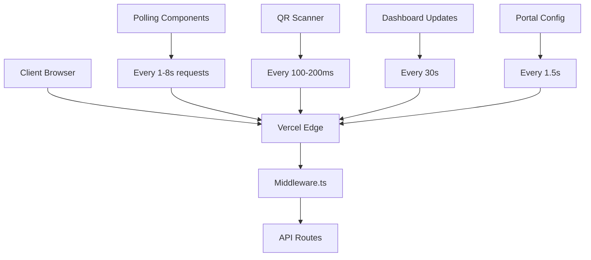
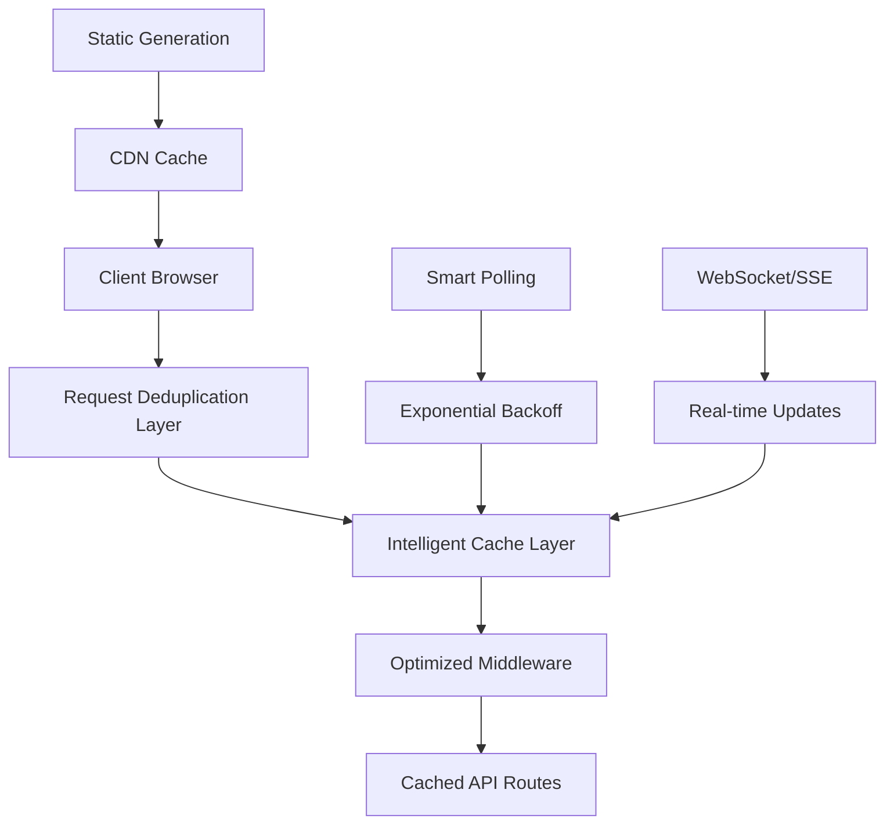

# Design Document

## Overview

Based on the analysis of the codebase, the excessive edge requests (500k on October 8th) are primarily caused by:

1. **Aggressive polling mechanisms** - Multiple components polling every 1-8 seconds
2. **Middleware execution on every request** - Complex middleware running on all routes
3. **Lack of proper caching** - API responses not being cached effectively
4. **QR Scanner intervals** - Running every 100-200ms when active
5. **Real-time updates** - Multiple polling intervals for dashboard updates

The solution involves implementing intelligent caching, optimizing polling strategies, and reducing middleware overhead.

## Architecture

### Current Problem Areas



### Optimized Architecture



## Components and Interfaces

### 1. Request Deduplication Service

```typescript
interface RequestDeduplicator {
  deduplicate<T>(key: string, request: () => Promise<T>, ttl?: number): Promise<T>;
  clear(pattern?: string): void;
}
```

**Purpose**: Prevent duplicate requests within short time windows

### 2. Intelligent Cache Manager

```typescript
interface CacheManager {
  get<T>(key: string): Promise<T | null>;
  set<T>(key: string, value: T, ttl: number): Promise<void>;
  invalidate(pattern: string): Promise<void>;
  getStats(): CacheStats;
}
```

**Purpose**: Implement multi-layer caching (memory, Redis, CDN)

### 3. Optimized Middleware

```typescript
interface MiddlewareOptimizer {
  shouldExecute(pathname: string): boolean;
  getCachedValidation(key: string): ValidationResult | null;
  setCachedValidation(key: string, result: ValidationResult): void;
}
```

**Purpose**: Reduce middleware execution for static routes and cache validations

### 4. Smart Polling Manager

```typescript
interface PollingManager {
  register(id: string, config: PollingConfig): void;
  unregister(id: string): void;
  pause(id: string): void;
  resume(id: string): void;
  setGlobalStrategy(strategy: PollingStrategy): void;
}

interface PollingConfig {
  interval: number;
  maxInterval: number;
  backoffMultiplier: number;
  onVisibilityChange: boolean;
}
```

**Purpose**: Centralize and optimize all polling mechanisms

## Data Models

### Cache Entry Model

```typescript
interface CacheEntry<T> {
  data: T;
  timestamp: number;
  ttl: number;
  hitCount: number;
  tags: string[];
}
```

### Request Metrics Model

```typescript
interface RequestMetrics {
  endpoint: string;
  count: number;
  avgResponseTime: number;
  errorRate: number;
  cacheHitRate: number;
  timestamp: Date;
}
```

### Polling Configuration Model

```typescript
interface PollingConfiguration {
  componentId: string;
  currentInterval: number;
  baseInterval: number;
  maxInterval: number;
  isActive: boolean;
  lastActivity: Date;
}
```

## Error Handling

### 1. Cache Fallback Strategy

- **Primary**: Memory cache (fastest)
- **Secondary**: Redis cache (shared across instances)
- **Fallback**: Direct API call with circuit breaker

### 2. Polling Error Recovery

- **Network errors**: Exponential backoff up to 5 minutes
- **Rate limiting**: Automatic pause and resume
- **Visibility changes**: Pause when tab inactive

### 3. Middleware Error Handling

- **Cache miss**: Continue with normal validation
- **Validation errors**: Log and allow request (fail-open)
- **Performance degradation**: Automatic cache cleanup

## Testing Strategy

### 1. Load Testing

- **Baseline measurement**: Current edge request patterns
- **Optimization testing**: Measure reduction after each optimization
- **Stress testing**: Simulate high traffic scenarios

### 2. Cache Testing

- **Hit rate testing**: Verify cache effectiveness
- **Invalidation testing**: Ensure data freshness
- **Memory leak testing**: Monitor cache size and cleanup

### 3. Polling Optimization Testing

- **Interval testing**: Verify exponential backoff works
- **Visibility testing**: Confirm pause/resume on tab changes
- **Network testing**: Test behavior under poor connections

### 4. Middleware Performance Testing

- **Route matching**: Test static route bypass
- **Cache performance**: Measure validation cache effectiveness
- **Memory usage**: Monitor middleware memory consumption

## Implementation Phases

### Phase 1: Immediate Optimizations (Week 1)
- Optimize existing polling intervals
- Implement basic request deduplication
- Add middleware route filtering

### Phase 2: Caching Layer (Week 2)
- Implement intelligent cache manager
- Add API response caching
- Optimize middleware validation cache

### Phase 3: Advanced Optimizations (Week 3)
- Implement smart polling manager
- Add WebSocket/SSE for real-time updates
- Implement static generation where possible

### Phase 4: Monitoring and Alerting (Week 4)
- Add request metrics collection
- Implement alerting system
- Create optimization dashboard

## Performance Targets

- **Edge requests reduction**: 70% decrease from current levels
- **Response time**: Maintain or improve current performance
- **Cache hit rate**: Achieve 80%+ for frequently accessed data
- **Polling efficiency**: Reduce polling frequency by 60%
- **Memory usage**: Keep middleware cache under 100MB