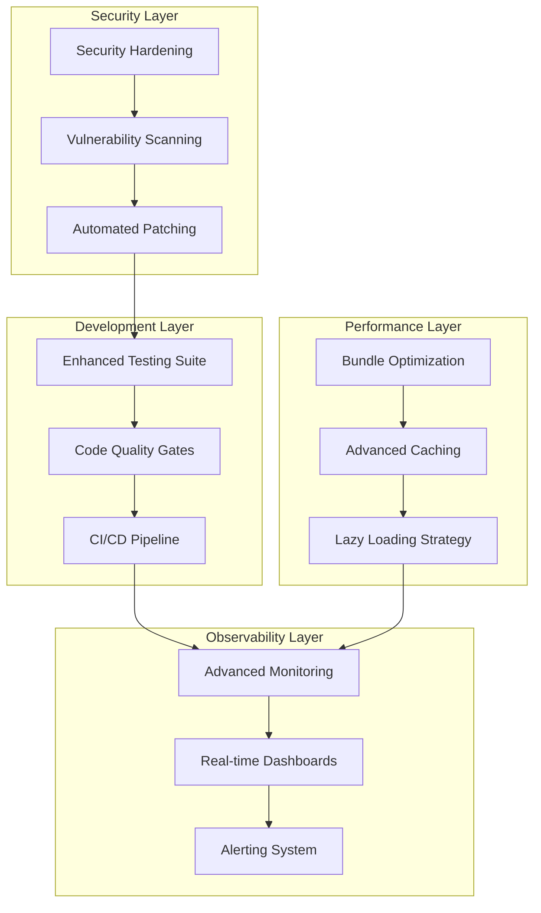

# Design Document - Project Excellence Roadmap

## Overview

Este documento presenta el diseño técnico para implementar las mejoras que elevarán el proyecto desde su nivel actual (8.5/10) hasta un nivel de excelencia profesional (9.5/10). El diseño se enfoca en 8 áreas clave: testing, observabilidad, performance, CI/CD, calidad de código, seguridad, documentación y escalabilidad.

## Architecture

### High-Level Architecture Enhancement



### Technology Stack Enhancement

| Component | Current | Enhanced | Justification |
|-----------|---------|----------|---------------|
| **Testing** | Vitest + Basic Tests | Vitest + Playwright + MSW | E2E coverage + API mocking |
| **Monitoring** | Sentry | Sentry + DataDog + Custom Metrics | Advanced observability |
| **CI/CD** | Manual Deployment | GitHub Actions + Vercel | Automated pipeline |
| **Performance** | Basic Optimization | Advanced Bundle Analysis + Lighthouse CI | Continuous performance monitoring |
| **Security** | Basic Auth | OWASP + Snyk + Security Headers | Enterprise-grade security |

## Components and Interfaces

### 1. Enhanced Testing Framework

#### Testing Architecture
```typescript
interface TestingFramework {
  unitTests: {
    coverage: number; // Target: 85%+
    framework: 'vitest';
    reporters: ['default', 'coverage', 'junit'];
  };
  
  integrationTests: {
    apiTesting: 'supertest' | 'msw';
    databaseTesting: 'testcontainers';
    authTesting: 'custom-mocks';
  };
  
  e2eTests: {
    framework: 'playwright';
    browsers: ['chromium', 'firefox', 'webkit'];
    environments: ['desktop', 'mobile'];
  };
}
```

#### Test Structure
```
tests/
├── unit/
│   ├── components/     # Component tests
│   ├── hooks/         # Custom hooks tests
│   ├── utils/         # Utility function tests
│   └── services/      # Service layer tests
├── integration/
│   ├── api/           # API endpoint tests
│   ├── database/      # Database operation tests
│   └── auth/          # Authentication flow tests
├── e2e/
│   ├── user-flows/    # Critical user journeys
│   ├── admin-flows/   # Admin functionality
│   └── mobile/        # Mobile-specific tests
└── performance/
    ├── load-tests/    # Load testing scenarios
    └── lighthouse/    # Performance audits
```

### 2. Advanced Observability System

#### Monitoring Architecture
```typescript
interface ObservabilityStack {
  errorTracking: {
    service: 'sentry';
    features: ['error-tracking', 'performance', 'releases'];
  };
  
  metrics: {
    service: 'datadog' | 'custom-prometheus';
    types: ['business', 'technical', 'user-experience'];
  };
  
  logging: {
    structured: true;
    levels: ['error', 'warn', 'info', 'debug'];
    correlation: 'trace-id';
  };
  
  alerting: {
    channels: ['slack', 'email', 'pagerduty'];
    conditions: ['error-rate', 'response-time', 'availability'];
  };
}
```

#### Custom Metrics Implementation
```typescript
// Enhanced metrics collection
interface MetricsCollector {
  // Business metrics
  trackUserEngagement(userId: string, action: string): void;
  trackBusinessMetrics(businessId: string, metric: BusinessMetric): void;
  
  // Technical metrics
  trackApiPerformance(endpoint: string, duration: number): void;
  trackCacheHitRate(cacheType: string, hitRate: number): void;
  
  // User experience metrics
  trackPageLoadTime(page: string, loadTime: number): void;
  trackErrorBoundary(component: string, error: Error): void;
}
```

### 3. Performance Optimization Advanced

#### Bundle Optimization Strategy
```typescript
interface BundleOptimization {
  codesplitting: {
    strategy: 'route-based' | 'component-based';
    chunkSizeLimit: 250; // KB
    preloadStrategy: 'critical-path';
  };
  
  treeshaking: {
    enabled: true;
    sideEffects: false;
    unusedExports: 'remove';
  };
  
  compression: {
    gzip: true;
    brotli: true;
    level: 9;
  };
}
```

#### Advanced Caching Strategy
```typescript
interface CachingStrategy {
  levels: {
    browser: 'service-worker' | 'cache-api';
    cdn: 'vercel-edge' | 'cloudflare';
    application: 'redis' | 'memory';
    database: 'query-cache' | 'result-cache';
  };
  
  policies: {
    static: '1y';
    api: '5m';
    dynamic: '1h';
    user: '15m';
  };
}
```

### 4. CI/CD Pipeline Implementation

#### Pipeline Architecture
```yaml
# GitHub Actions Workflow Structure
name: Production Pipeline
on:
  push:
    branches: [main, develop]
  pull_request:
    branches: [main]

jobs:
  quality-gates:
    - lint-and-format
    - type-check
    - security-scan
    - dependency-audit
  
  testing:
    - unit-tests
    - integration-tests
    - e2e-tests
    - performance-tests
  
  build-and-deploy:
    - build-optimization
    - bundle-analysis
    - deploy-staging
    - smoke-tests
    - deploy-production
```

#### Deployment Strategy
```typescript
interface DeploymentStrategy {
  environments: {
    development: 'auto-deploy';
    staging: 'auto-deploy-on-merge';
    production: 'manual-approval';
  };
  
  rollback: {
    automatic: 'on-health-check-fail';
    manual: 'one-click-rollback';
    strategy: 'blue-green' | 'canary';
  };
  
  monitoring: {
    healthChecks: 'continuous';
    alerting: 'immediate';
    rollbackTriggers: ['error-rate > 5%', 'response-time > 2s'];
  };
}
```

## Data Models

### Testing Data Models
```typescript
interface TestResult {
  id: string;
  timestamp: Date;
  type: 'unit' | 'integration' | 'e2e' | 'performance';
  coverage: {
    lines: number;
    functions: number;
    branches: number;
    statements: number;
  };
  performance: {
    duration: number;
    memoryUsage: number;
  };
  results: {
    passed: number;
    failed: number;
    skipped: number;
  };
}
```

### Monitoring Data Models
```typescript
interface MetricEvent {
  id: string;
  timestamp: Date;
  type: 'business' | 'technical' | 'user-experience';
  source: string;
  tags: Record<string, string>;
  value: number;
  unit: string;
}

interface AlertRule {
  id: string;
  name: string;
  condition: string;
  threshold: number;
  severity: 'low' | 'medium' | 'high' | 'critical';
  channels: string[];
  enabled: boolean;
}
```

## Error Handling

### Enhanced Error Handling Strategy
```typescript
interface ErrorHandlingStrategy {
  boundaries: {
    component: 'react-error-boundary';
    api: 'custom-error-middleware';
    async: 'promise-rejection-handler';
  };
  
  recovery: {
    automatic: 'retry-with-backoff';
    manual: 'user-initiated-retry';
    fallback: 'graceful-degradation';
  };
  
  reporting: {
    user: 'user-friendly-messages';
    developer: 'detailed-stack-traces';
    monitoring: 'structured-error-events';
  };
}
```

### Error Classification System
```typescript
enum ErrorSeverity {
  LOW = 'low',           // Non-critical, doesn't affect user experience
  MEDIUM = 'medium',     // Affects some functionality
  HIGH = 'high',         // Affects core functionality
  CRITICAL = 'critical'  // System-wide impact
}

interface ErrorContext {
  userId?: string;
  businessId?: string;
  sessionId: string;
  userAgent: string;
  url: string;
  timestamp: Date;
  breadcrumbs: Breadcrumb[];
}
```

## Testing Strategy

### Comprehensive Testing Approach
```typescript
interface TestingStrategy {
  pyramid: {
    unit: '70%';        // Fast, isolated tests
    integration: '20%'; // API and service tests
    e2e: '10%';        // Critical user flows
  };
  
  coverage: {
    minimum: 85;
    target: 90;
    critical: 95; // For security and payment flows
  };
  
  automation: {
    ci: 'all-tests-on-pr';
    cd: 'smoke-tests-on-deploy';
    scheduled: 'full-suite-nightly';
  };
}
```

### Test Categories Implementation
```typescript
// Unit Tests
describe('Component Tests', () => {
  // Component rendering and behavior
  // Hook functionality
  // Utility functions
});

// Integration Tests
describe('API Integration', () => {
  // Database operations
  // External service calls
  // Authentication flows
});

// E2E Tests
describe('User Journeys', () => {
  // Complete user workflows
  // Cross-browser compatibility
  // Mobile responsiveness
});

// Performance Tests
describe('Performance Benchmarks', () => {
  // Load testing
  // Memory usage
  // Bundle size validation
});
```

## Security Enhancements

### Security Hardening Implementation
```typescript
interface SecurityEnhancements {
  headers: {
    csp: 'strict-content-security-policy';
    hsts: 'strict-transport-security';
    xframe: 'deny';
    xss: 'block';
  };
  
  scanning: {
    dependencies: 'snyk' | 'npm-audit';
    code: 'sonarqube' | 'codeql';
    containers: 'trivy' | 'clair';
  };
  
  monitoring: {
    intrusion: 'real-time-detection';
    anomaly: 'ml-based-detection';
    compliance: 'automated-auditing';
  };
}
```

### Vulnerability Management
```typescript
interface VulnerabilityManagement {
  scanning: {
    frequency: 'daily';
    scope: ['dependencies', 'code', 'infrastructure'];
    automation: 'auto-fix-low-severity';
  };
  
  response: {
    critical: 'immediate-patch';
    high: 'patch-within-24h';
    medium: 'patch-within-week';
    low: 'patch-next-release';
  };
}
```

## Performance Optimization

### Advanced Performance Strategy
```typescript
interface PerformanceStrategy {
  metrics: {
    fcp: '< 1.5s';      // First Contentful Paint
    lcp: '< 2.5s';      // Largest Contentful Paint
    fid: '< 100ms';     // First Input Delay
    cls: '< 0.1';       // Cumulative Layout Shift
    ttfb: '< 600ms';    // Time to First Byte
  };
  
  optimization: {
    images: 'next-image-optimization';
    fonts: 'font-display-swap';
    css: 'critical-css-inlining';
    js: 'code-splitting-lazy-loading';
  };
  
  monitoring: {
    realUser: 'web-vitals-tracking';
    synthetic: 'lighthouse-ci';
    continuous: 'performance-budgets';
  };
}
```

## Implementation Phases

### Phase 1: Foundation (Week 1-2)
- Enhanced testing framework setup
- Basic observability implementation
- CI/CD pipeline foundation

### Phase 2: Advanced Features (Week 3-4)
- Performance optimization implementation
- Security hardening
- Advanced monitoring setup

### Phase 3: Excellence (Week 5-6)
- Documentation enhancement
- Scalability improvements
- Final optimizations and polish

## Success Metrics

### Key Performance Indicators
```typescript
interface SuccessMetrics {
  quality: {
    testCoverage: '>= 85%';
    bugEscapeRate: '< 2%';
    codeQualityScore: '>= 9/10';
  };
  
  performance: {
    pageLoadTime: '< 1.5s';
    apiResponseTime: '< 200ms';
    errorRate: '< 0.5%';
  };
  
  reliability: {
    uptime: '>= 99.9%';
    mttr: '< 15min';
    deploymentSuccess: '>= 98%';
  };
  
  security: {
    vulnerabilities: '0 critical, 0 high';
    securityScore: '>= 95%';
    complianceRate: '100%';
  };
}
```