# 🏗️ Arquitectura del Sistema Lealta 2.0

## 📊 **Diagrama General del Sistema**


## 🏢 **Arquitectura Multi-Tenant**

```mermaid
graph LR
    subgraph "Business Isolation"
        A[Business 1] --> B[Users 1]
        A --> C[Clients 1]
        A --> D[Data 1]
        
        E[Business 2] --> F[Users 2]
        E --> G[Clients 2]
        E --> H[Data 2]
        
        I[Business N] --> J[Users N]
        I --> K[Clients N]
        I --> L[Data N]
    end
    
    subgraph "Shared Infrastructure"
        M[NextAuth] --> N[Prisma]
        N --> O[(PostgreSQL)]
        P[Error Handler] --> Q[Sentry]
        R[File Storage] --> S[Vercel Blob]
    end
    
    B --> M
    F --> M
    J --> M
    
    C --> N
    G --> N
    K --> N
    
    D --> O
    H --> O
    L --> O
```



## 🔄 **Flujo de Datos Principal**


## 🗂️ **Estructura de Carpetas**

```mermaid
graph TD
    A[src/] --> B[app/]
    A --> C[components/]
    A --> D[lib/]
    A --> E[utils/]
    A --> F[types/]
    A --> G[middleware/]
    A --> H[hooks/]
    
    B --> B1[api/]
    B --> B2[[businessId]/]
    B --> B3[admin/]
    B --> B4[cliente/]
    B --> B5[staff/]
    
    B1 --> B1A[auth/]
    B1 --> B1B[portal/]
    B1 --> B1C[staff/]
    B1 --> B1D[admin/]
    B1 --> B1E[cliente/]
    
    C --> C1[ui/]
    C --> C2[admin-v2/]
    C --> C3[cliente/]
    C --> C4[layouts/]
    
    D --> D1[auth.config.ts]
    D --> D2[error-handler.ts]
    D --> D3[prisma.ts]
    D --> D4[validations.ts]
    
    E --> E1[business.ts]
    E --> E2[evaluate-level.ts]
    E --> E3[logger.ts]
    
    F --> F1[next-auth.d.ts]
    F --> F2[prisma.ts]
    F --> F3[api-routes.ts]
    
    G --> G1[api-error-middleware.ts]
    G --> G2[requireAuth.ts]
    G --> G3[security.ts]
```

## 🎯 **Modelo de Datos (Entidades Principales)**


## 🔐 **Flujo de Autenticación**


## 🚀 **Arquitectura de Deployment**


## 🎨 **Componentes UI Hierarchy**


## 🔄 **PWA Architecture**


---

## 📝 **Cómo usar estos diagramas:**

1. **Copia cualquier diagrama** que te interese
2. **Pégalo en cualquier editor Mermaid** como:
   - [Mermaid Live Editor](https://mermaid.live/)
   - GitHub (en archivos .md)
   - Notion, Obsidian, etc.
3. **Personaliza** según tus necesidades

## 🎯 **Diagramas más útiles para presentaciones:**

- **Diagrama General** - Para overview técnico
- **Multi-Tenant** - Para explicar escalabilidad
- **Flujo de Datos** - Para entender el proceso
- **Modelo de Datos** - Para arquitectura de BD

¿Te gustaría que profundice en algún diagrama específico o cree alguno adicional?