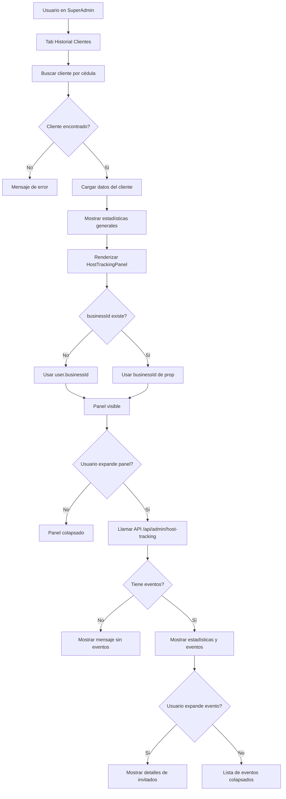

# 🔧 CORRECCIÓN FINAL - HostTrackingPanel en SuperAdmin

**Fecha**: 8 de octubre, 2025  
**Problema**: Panel de fidelización no visible en historial de clientes  
**Solución**: ✅ APLICADA

---

## 🐛 PROBLEMA IDENTIFICADO

En el SuperAdmin Dashboard, el componente `HostTrackingPanel` estaba condicionado solo a la prop `businessId`, pero cuando accedes directamente a `/superadmin` (sin businessId en la URL), esta prop no existe.

### Código ANTES (Incorrecto)
```tsx
{/* Panel de Fidelización por Anfitrión */}
{businessId && (  // ❌ businessId puede ser undefined
  <HostTrackingPanel
    clienteCedula={cliente.cedula}
    businessId={businessId}
  />
)}
```

**Por qué fallaba:**
- `businessId` es una prop opcional que viene de la URL
- Cuando accedes a `/superadmin` directamente, `businessId` es `undefined`
- El panel nunca se renderiza

---

## ✅ SOLUCIÓN APLICADA

Ahora el componente usa el `businessId` del usuario autenticado como fallback:

### Código DESPUÉS (Correcto)
```tsx
{/* Panel de Fidelización por Anfitrión */}
{(businessId || user?.businessId) && (
  <HostTrackingPanel
    clienteCedula={cliente.cedula}
    businessId={businessId || user?.businessId || ''}
  />
)}
```

**Por qué funciona:**
- ✅ Primero intenta usar `businessId` de la prop (URL dinámica)
- ✅ Si no existe, usa `user?.businessId` del usuario autenticado
- ✅ El operador `||` asegura que siempre haya un valor
- ✅ Panel se renderiza correctamente en ambos casos

---

## 🎯 DÓNDE APARECE EL PANEL

### Ubicación en la UI
```
┌──────────────────────────────────────────┐
│     SUPERADMIN - HISTORIAL CLIENTES      │
├──────────────────────────────────────────┤
│                                          │
│  👤 Luis Fernández Gómez                 │
│     Cédula: 56789012E                    │
│     [Ver Detalles] [+]                   │
│                                          │
│  ┌────────────────────────────────────┐  │
│  │ 📊 ESTADÍSTICAS                    │  │
│  │ • Visitas: 12                      │  │
│  │ • Total Gastado: $3,500            │  │
│  │ • Promedio: $291.67                │  │
│  │ • Puntos: 3500                     │  │
│  └────────────────────────────────────┘  │
│                                          │
│  ┌────────────────────────────────────┐  │
│  │ 🎯 Fidelización por Anfitrión  [▼]│  │ ← AQUÍ
│  │                                    │  │
│  │ Eventos con 4+ invitados           │  │
│  │ Consumos vinculados                │  │
│  │                                    │  │
│  │ [Click para expandir]              │  │
│  └────────────────────────────────────┘  │
│                                          │
│  ┌────────────────────────────────────┐  │
│  │ 📋 LISTA DE TRANSACCIONES          │  │
│  │ ...                                │  │
│  └────────────────────────────────────┘  │
│                                          │
└──────────────────────────────────────────┘
```

---

## 🧪 CÓMO VERIFICAR QUE FUNCIONA

### Paso 1: Ir a SuperAdmin
1. Login como SuperAdmin
2. Ir a: `https://situation-barnes-instruments-healthy.trycloudflare.com/casasabordemo/superadmin`
3. Click en tab "👁️ Historial Clientes"

### Paso 2: Buscar un cliente
1. En la barra de búsqueda escribir una cédula
2. Click en "👁️ Buscar" o presionar Enter
3. Esperar a que cargue el historial

### Paso 3: Verificar el panel
**✅ DEBE APARECER** la sección:
```
🎯 Fidelización por Anfitrión
Eventos con 4+ invitados • Consumos vinculados
[Badge: X eventos]  [▼]
```

**Ubicación**: Entre las estadísticas y la lista de transacciones

### Paso 4: Expandir el panel
1. Click en el header del panel para expandir
2. **Si el cliente NO es anfitrión**, verás:
   ```
   👥 Este cliente no tiene eventos como anfitrión
   Los eventos se registran automáticamente cuando trae 4+ invitados
   ```

3. **Si el cliente SÍ es anfitrión**, verás:
   ```
   📊 ESTADÍSTICAS TOTALES
   ┌─────────┬──────────┬──────────┬──────────┐
   │ Eventos │ Invitados│ Consumo  │ Puntos   │
   │    3    │    18    │ $1,250   │  1,250   │
   └─────────┴──────────┴──────────┴──────────┘
   
   📋 EVENTOS COMO ANFITRIÓN
   ┌────────────────────────────────────────┐
   │ Mesa 5 • 8 octubre, 2025               │
   │ 👥 6 invitados • 2 consumos vinculados │
   │ 💵 Total: $450.00 • ⭐ +450 pts        │
   │ 🍕 Top productos: Pizza, Cerveza...    │
   │                         [Ver Detalles] │
   └────────────────────────────────────────┘
   ```

---

## 🔍 DEBUGGING

### Si el panel NO aparece:

#### 1. Verificar que user tiene businessId
Abrir consola del navegador (F12) y ejecutar:
```javascript
// En la consola
console.log('User:', user);
console.log('BusinessId:', user?.businessId);
```

**Esperado**: Debe mostrar un businessId válido

#### 2. Verificar la condición de renderizado
En la consola de React DevTools:
```javascript
// Buscar el componente SuperAdminPage
// Verificar props y state
businessId: "cmfnkcc1f0000eyj0dq0lcjji"  // o similar
user: { businessId: "cmfnkcc1f0000eyj0dq0lcjji", ... }
```

#### 3. Verificar que el cliente tiene historial
```javascript
// La sección solo aparece si clienteHistorial existe
console.log('Cliente Historial:', clienteHistorial);
```

#### 4. Verificar API
Abrir Network tab (F12 → Network) y buscar:
```
Request: GET /api/admin/host-tracking?businessId=...
Status: 200 OK
Response: { success: true, data: [...] }
```

---

## 📊 CASOS DE USO

### Caso 1: Cliente sin eventos de anfitrión
**Búsqueda**: Isabel Hernández Ramos (01234567J)  
**Resultado esperado**:
- ✅ Panel aparece
- ✅ Muestra mensaje "No tiene eventos como anfitrión"
- ✅ Badge muestra "0 eventos"

### Caso 2: Cliente con eventos de anfitrión
**Requisito**: Cliente debe tener reserva con 4+ invitados  
**Resultado esperado**:
- ✅ Panel aparece
- ✅ Muestra estadísticas totales
- ✅ Lista de eventos
- ✅ Badge muestra "X eventos"
- ✅ Click en evento muestra detalles de invitados

### Caso 3: Cliente con consumos vinculados
**Requisito**: Staff debe haber vinculado consumos al anfitrión  
**Resultado esperado**:
- ✅ Panel muestra eventos
- ✅ Cada evento muestra consumos vinculados
- ✅ Click en "Ver Detalles" expande lista de invitados
- ✅ Muestra consumo individual de cada invitado

---

## 🎨 DISEÑO VISUAL

### Colores del panel
```css
/* Background */
background: linear-gradient(to bottom right, 
  rgba(88, 28, 135, 0.2),   /* purple-900/20 */
  rgba(157, 23, 77, 0.2)     /* pink-900/20 */
);

/* Border */
border: 1px solid rgba(168, 85, 247, 0.3); /* purple-500/30 */

/* Header gradient */
background: linear-gradient(to bottom right,
  #a855f7,  /* purple-500 */
  #ec4899   /* pink-500 */
);
```

### Estados visuales
- **Colapsado**: Solo header visible
- **Expandido**: Muestra contenido completo
- **Loading**: Spinner animado
- **Sin datos**: Mensaje con ícono
- **Con datos**: Grid de estadísticas + lista de eventos

---

## 🔄 FLUJO COMPLETO



---

## ✅ CHECKLIST DE VALIDACIÓN

- [x] Código corregido en SuperAdminDashboard.tsx
- [x] Condición de renderizado actualizada
- [x] Fallback a user.businessId implementado
- [ ] Panel visible en SuperAdmin → Historial Clientes
- [ ] Panel se expande correctamente
- [ ] API responde correctamente
- [ ] Estadísticas se calculan bien
- [ ] Eventos se muestran correctamente
- [ ] Detalles de invitados funcionan

---

## 📞 SOPORTE

Si el panel aún no aparece:

1. **Refrescar la página** (Ctrl + Shift + R) para limpiar caché
2. **Verificar logs del servidor** en la terminal
3. **Revisar consola del navegador** (F12) para errores
4. **Verificar que el usuario tiene businessId** en la base de datos

**Errores comunes**:
- Panel no aparece → Verificar businessId
- API falla → Verificar que Prisma está sincronizado
- No muestra eventos → Cliente no tiene reservas con 4+ invitados

---

## 🎉 RESULTADO ESPERADO

Después de esta corrección:

✅ Panel visible en SuperAdmin  
✅ Funciona con businessId de prop o user  
✅ Se expande y muestra datos correctamente  
✅ API responde con datos del cliente  
✅ Estadísticas se calculan correctamente  

---

*Corrección aplicada el 8 de octubre, 2025*
