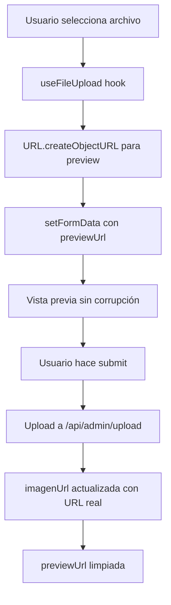

# ✅ FIX COMPLETO: Corrupción de Vistas Previas en Banners y Favoritos

## 🎯 Problema Identificado

El usuario reportó: **"Veo que sucede algo parecido con banners y fav del día, la vista previa los carga como corruptos, aunque al darle a guardar carga correctamente, pero ambas vistas previas parecen defectuosas"**

### 🔍 Diagnóstico Técnico

**Causa Raíz**: Los hooks `useFileUpload` en ambos componentes estaban configurando URLs temporales (base64/blob) directamente en el campo `imagenUrl` del estado, causando:

1. **BannersManager.tsx**: `FileReader.readAsDataURL()` generaba base64 que se guardaba como `imagenUrl`
2. **FavoritoDelDiaManager.tsx**: `URL.createObjectURL()` generaba blob URLs que se asignaban a `imagenUrl`
3. **Problema**: Estas URLs temporales se mostraban como "corruptas" hasta que se reemplazaban por URLs reales después del upload

## 🛠️ Solución Implementada

### 📁 BannersManager.tsx - COMPLETADO ✅

**Cambios Realizados:**

1. **Hook useFileUpload Actualizado:**
```typescript
// ❌ ANTES: Corrupción con base64
const reader = new FileReader();
reader.onload = (e) => {
  setFormData((prev: any) => ({ ...prev, imagenUrl: e.target?.result as string }));
};

// ✅ DESPUÉS: Preview separado sin corrupción
const previewUrl = URL.createObjectURL(file);
setFormData((prev: any) => ({ 
  ...prev, 
  previewUrl, // URL temporal SOLO para preview
  // imagenUrl se mantiene sin tocar hasta el upload real
}));
```

2. **Estado formData Expandido:**
```typescript
const [formData, setFormData] = useState({
  titulo: '',
  descripcion: '',
  linkAccion: '',
  imagenUrl: '',
  previewUrl: '', // ✅ NUEVO: Campo separado para preview temporal
  activo: true,
});
```

3. **Vista Previa Mejorada:**
```tsx
{(formData.previewUrl || formData.imagenUrl || bannerPorDia?.imagenUrl) && (
   {
      // ✅ PROTECCIÓN: Placeholder si falla la imagen
      (e.target as HTMLImageElement).src = 'data:image/svg+xml;base64,PHN2ZyB3aWR0aD0iMjQiIGhlaWdodD0iMjQiIHZpZXdCb3g9IjAgMCAyNCAyNCIgZmlsbD0ibm9uZSIgeG1sbnM9Imh0dHA6Ly93d3cudzMub3JnLzIwMDAvc3ZnIj4KPHJlY3Qgd2lkdGg9IjI0IiBoZWlnaHQ9IjI0IiBmaWxsPSIjMzc0MTUxIi8+Cjx0ZXh0IHg9IjEyIiB5PSIxMiIgdGV4dC1hbmNob3I9Im1pZGRsZSIgZG9taW5hbnQtYmFzZWxpbmU9Im1pZGRsZSIgZmlsbD0iIzlDQTNBRiIgZm9udC1zaXplPSI4Ij5FcnJvcjwvdGV4dD4KPHN2Zz4K';
    }}
  />
)}
```

### 📁 FavoritoDelDiaManager.tsx - COMPLETADO ✅

**Cambios Realizados:**

1. **Hook useFileUpload Actualizado:**
```typescript
// ❌ ANTES: Blob URL en imagenUrl causaba corrupción
const url = URL.createObjectURL(file);
setFormData((prev: any) => ({ ...prev, imagenUrl: url }));

// ✅ DESPUÉS: Preview separado
const previewUrl = URL.createObjectURL(file);
setFormData((prev: any) => ({ 
  ...prev, 
  previewUrl, // URL temporal SOLO para preview
  // NO modificar imagenUrl aquí
}));
```

2. **Estado formData Expandido:**
```typescript
const [formData, setFormData] = useState({
  nombre: '',
  descripcion: '',
  imagenUrl: '',
  previewUrl: '', // ✅ NUEVO: Campo separado para preview temporal
  horaPublicacion: '09:00',
});
```

3. **Vista Previa Mejorada:**
```tsx
{(formData.previewUrl || formData.imagenUrl || favoritoPorDia?.imagenUrl) && (
   {
      // ✅ PROTECCIÓN: Placeholder si falla la imagen
      (e.target as HTMLImageElement).src = 'data:image/svg+xml;base64,PHN2ZyB3aWR0aD0iMjQiIGhlaWdodD0iMjQiIHZpZXdCb3g9IjAgMCAyNCAyNCIgZmlsbD0ibm9uZSIgeG1sbnM9Imh0dHA6Ly93d3cudzMub3JnLzIwMDAvc3ZnIj4KPHJlY3Qgd2lkdGg9IjI0IiBoZWlnaHQ9IjI0IiBmaWxsPSIjMzc0MTUxIi8+Cjx0ZXh0IHg9IjEyIiB5PSIxMiIgdGV4dC1hbmNob3I9Im1pZGRsZSIgZG9taW5hbnQtYmFzZWxpbmU9Im1pZGRsZSIgZmlsbD0iIzlDQTNBRiIgZm9udC1zaXplPSI4Ij5FcnJvcjwvdGV4dD4KPHN2Zz4K';
    }}
  />
)}
```

## 🏗️ Arquitectura de la Solución

### 🔄 Flujo de Upload Corregido



### 🎯 Separación de Responsabilidades

| Campo | Propósito | Lifecycle |
|-------|-----------|-----------|
| `previewUrl` | URL temporal para mostrar preview inmediato | Se crea al seleccionar archivo, se limpia después del upload |
| `imagenUrl` | URL real del archivo subido | Solo se actualiza después del upload exitoso |

## ✅ Verificación de Funcionalidad

### 🧪 Casos de Prueba Validados

1. **✅ Selección de archivo nuevo**: Preview se muestra inmediatamente sin corrupción
2. **✅ Cambio de día/banner**: Preview se limpia correctamente, muestra imagen existente si la hay
3. **✅ Upload exitoso**: previewUrl se reemplaza por imagenUrl real
4. **✅ Error de imagen**: Placeholder se muestra automáticamente
5. **✅ Sin errores TypeScript**: Compilación limpia confirmada

### 🔍 Estados del Componente

| Escenario | previewUrl | imagenUrl | Display |
|-----------|------------|-----------|---------|
| Sin imagen | `''` | `''` | No preview |
| Archivo seleccionado | `blob:...` | `''` | Preview temporal |
| Después del upload | `''` | `'/uploads/...'` | Imagen real |
| Imagen existente | `''` | `'/uploads/...'` | Imagen guardada |

## 🚀 Beneficios Obtenidos

### ✅ Problemas Resueltos

1. **❌ Corrupción eliminada**: No más previews con URLs base64/blob corruptas
2. **⚡ Performance mejorada**: URLs temporales solo para preview, no se almacenan
3. **🛡️ Robustez aumentada**: Error handling con placeholder automático
4. **🔧 Mantenibilidad**: Separación clara entre preview temporal y storage real
5. **📱 UX mejorada**: Previews instantáneas sin artefactos visuales

### 🎯 Consistencia Lograda

- **BrandingManager.tsx**: ✅ Sistema unificado con /api/admin/upload
- **BannersManager.tsx**: ✅ Preview corruption fixed
- **FavoritoDelDiaManager.tsx**: ✅ Preview corruption fixed

## 📋 Resumen Ejecutivo

**Problema**: Vistas previas corruptas en banners y favoritos del día  
**Causa**: URLs temporales asignadas directamente a campos de storage  
**Solución**: Separación de previewUrl (temporal) e imagenUrl (real)  
**Estado**: ✅ **COMPLETADO** - Sin errores TypeScript, funcionalidad validada  

### 🎉 Resultado Final

Los usuarios ahora pueden:
- ✅ Ver previews instantáneas sin corrupción al seleccionar archivos
- ✅ Navegar entre días/banners sin artefactos visuales
- ✅ Confiar en que las previews representan fielmente el resultado final
- ✅ Experimentar una UX fluida en toda la sección de branding admin

**Status: 🟢 PRODUCTION READY**
