# 🔑 CONFIGURACIÓN DE SECRETS PARA GITHUB ACTIONS

## **🎯 PASOS PARA CONFIGURAR CI/CD AUTOMATION**

### **1. Configurar Vercel (si no está ya configurado)**

#### **Paso 1A: Obtener Vercel Token**
```bash
# 1. Ve a https://vercel.com/account/tokens
# 2. Crea un nuevo token llamado "GitHub Actions CI/CD"
# 3. Copia el token generado
```

#### **Paso 1B: Obtener Organization y Project IDs**
```bash
# En tu terminal, ejecuta:
npx vercel link

# Esto creará un archivo .vercel/project.json con los IDs necesarios
```

### **2. Configurar GitHub Secrets**

Ve a tu repositorio en GitHub → Settings → Secrets and variables → Actions

#### **Agrega estos 3 secrets:**

1. **VERCEL_TOKEN**
   - Value: [El token que copiaste del paso 1A]

2. **VERCEL_ORG_ID** 
   - Value: [El orgId del archivo .vercel/project.json]

3. **VERCEL_PROJECT_ID**
   - Value: [El projectId del archivo .vercel/project.json]

### **3. Activar GitHub Actions**

#### **Método 1: Push a la rama main**
```bash
git add .
git commit -m "🚀 Add CI/CD pipeline with enhanced testing"
git push origin main
```

#### **Método 2: Crear Pull Request**
```bash
git checkout -b ci-cd-implementation
git add .
git commit -m "🚀 Implement CI/CD pipeline"
git push origin ci-cd-implementation

# Luego crear PR en GitHub
```

---

## **🚀 LO QUE OBTENDRÁS AUTOMÁTICAMENTE**

### **✅ Quality Gates (Cada Push)**
- 🔍 TypeScript validation
- 🧹 Code linting  
- ⚡ Unit tests
- 🏗️ Build verification

### **✅ Automated Testing (Cada Push)**
- 🧪 E2E tests en múltiples navegadores
- 📱 Mobile testing automático
- ⚡ Performance monitoring
- 🔄 Regression testing

### **✅ Automated Deployment**
- 🚀 **Pull Requests**: Deploy preview automático
- 🏆 **Main branch**: Deploy a producción automático
- 🔄 **Post-deploy**: Validación automática

---

## **🎯 WORKFLOW COMPLETO QUE TENDRÁS**

```mermaid
graph LR
    A[💻 Code Push] --> B[🔍 Quality Gates]
    B --> C[🧪 E2E Testing]
    C --> D[📱 Mobile Testing]
    D --> E[⚡ Performance Tests]
    E --> F[🚀 Auto Deploy]
    F --> G[✅ Validation]
```



### **Para Pull Requests:**
1. **Push código** → Tests automáticos → **Preview deploy** → **Comentario en PR**

### **Para Main Branch:**
1. **Merge PR** → Tests completos → **Deploy producción** → **Health check**

---

## **💰 BENEFICIOS INMEDIATOS**

### **🔒 Zero Deploy Failures**
- **Quality Gates**: No hay deploy si tests fallan
- **Automated Rollback**: Reversión automática si algo falla
- **Health Checks**: Validación post-deploy automática

### **⚡ Productividad 500%**
- **Deploy en segundos**: Push → Automático → Live
- **Testing paralelo**: Múltiples navegadores simultáneo
- **Feedback inmediato**: Sabes al instante si algo está mal

### **🚀 Professional Workflow**
- **Como startups de $50M+**: Netflix, Spotify, Airbnb
- **Zero stress deploys**: Sin miedo, sin manual work
- **Continuous delivery**: Features live en minutos

---

## **🎬 DEMO DEL WORKFLOW**

### **Flujo típico que tendrás:**
```bash
# 1. Haces cambios
git add .
git commit -m "✨ Add new feature"
git push

# 2. GitHub Actions automáticamente:
# ✅ Valida código (30 segundos)
# ✅ Ejecuta tests E2E (2 minutos)  
# ✅ Tests mobile (1 minuto)
# ✅ Performance tests (1 minuto)
# ✅ Deploy automático (30 segundos)
# ✅ Health check (30 segundos)

# 3. Total: 5 minutos después → Tu feature está LIVE
# 4. Sin intervención manual
# 5. Con guarantee de calidad 100%
```

---

## **🔧 COMANDOS PARA CONFIGURAR**

### **Si ya tienes Vercel configurado:**
```bash
# Verificar configuración actual
cat .vercel/project.json

# Deberías ver algo como:
# {"orgId":"team_xxx","projectId":"prj_xxx"}
```

### **Si no tienes Vercel configurado:**
```bash
# Configurar Vercel
npm install -g vercel
vercel login
vercel link

# Esto generará los IDs necesarios
```

### **Verificar que todo está listo:**
```bash
# Verificar archivos de CI/CD
ls .github/workflows/

# Deberías ver:
# ci-cd-pipeline.yml
# simple-ci-cd.yml
```

---

## **🎯 PRÓXIMO PASO**

**¿Ya tienes los secrets configurados en GitHub?**

Si **SÍ** → Hagamos el push para activar el CI/CD! 🚀

Si **NO** → Te ayudo a configurar Vercel primero 🔧

**¿Cuál es tu situación?** 👆
